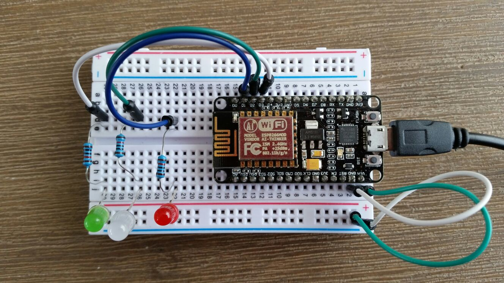
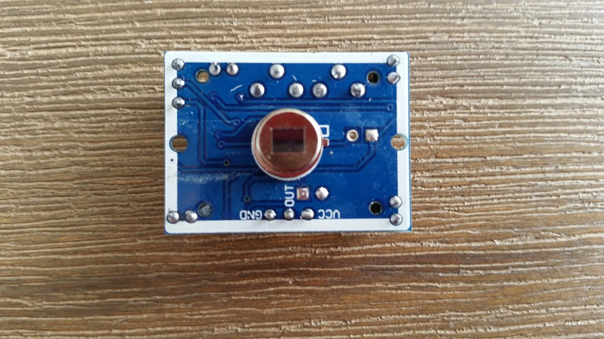
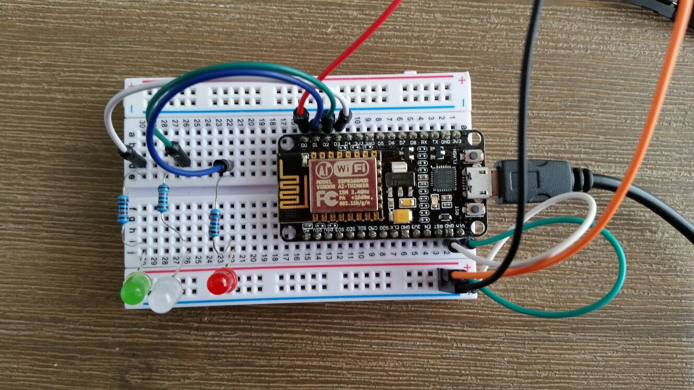
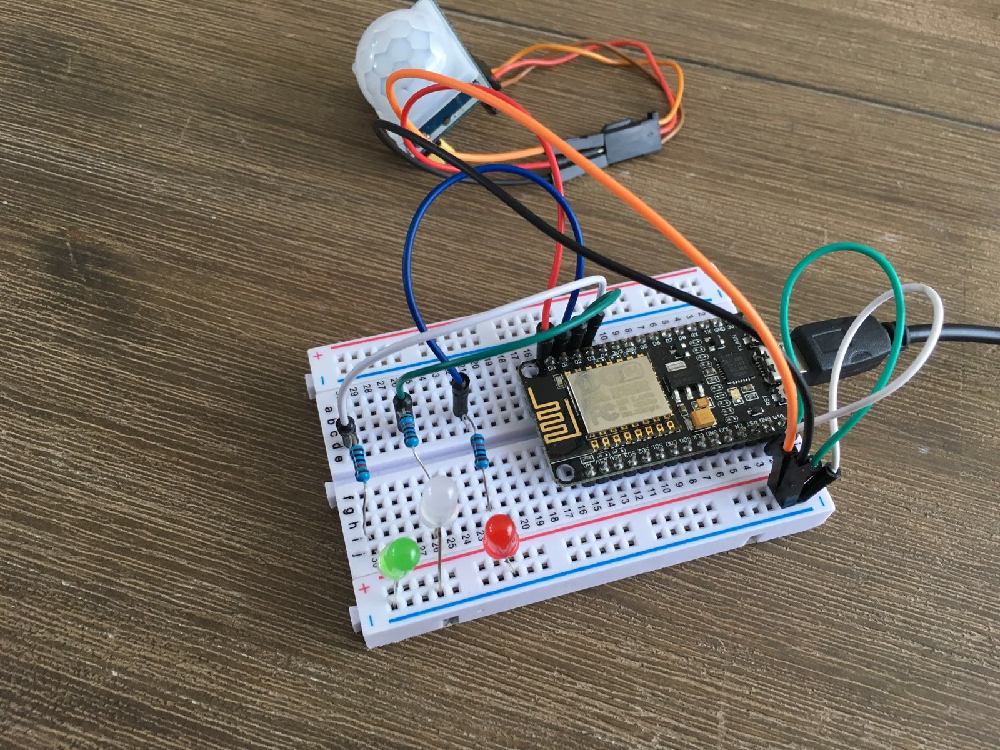

#How can I measure how often I move during sleep?

Too often I go to bed and wake up the next morning feeling even more tired than the day before. For this purpose I created a detection system which tracks how often I move during my sleep. This will enable me to draw conclusions about my living and sleeping pattern. In this manual I will show you how to use what I made for your benefit as well.

The detection system exists of three phases. Ranging from good to bad. Depending on the amount of movement that has been detected, a certain color LED light will go on. Giving you an immediate indication of your quality of sleep.

Let's get started.

##Hardware
###Requirements
To create this detection system, you will need to have the following items at your disposal:

- 1x NodeMCU with WiFi
- 1x breadboard
- 1x PIR Motion Sensor
- 3x LED light (green, red and white)
- 3x resistance for the LEDs
- Enough wires to connect everything, including three female
- USB to Micro-USB cable

###Connecting everything
If you have the right hardware in front of you, it's time to connect everything. Luckily, this is very straightforward.

First off, plug your NodeMCU in the breadboard, make sure there's enough space on both sides to connect the wires. After you've done this, let's give your lEDs some juice. 
Make sure the short end of your LED is connected to your ground and the long end to your digital port. Use a resistance to prevent your LEDs from overheating. Use these ports to connect your hardware:

| Hardware	   | Port         | 
| ------------- |:-------------:| 
| PIR Sensor    | D0            | 
| Red LED	      | D1            | 
| White LED     | D2            | 
| Green LED     | D3            | 


Setup for the LEDs.

To connect the PIR Sensor, you have to pay some good attention to what pin means what. When looking closely at your PIR Sensor, you will see that the three pins have been labeled. We have a GND (ground), OUT (output) and a VCC (power). Make sure to connect each pin according to their function. Connect its output pin with the D0 port on your NodeMCU.




Your final setup will look like this:





##Install
###Requirements
You will need:

- Arduino app
- ArduinoJSON library
- ESP8266WiFi library

Download the right libraries and add them to Arduino's libraries folder on your PC.

###Using the application
After everything is setup and you have connected your NodeMCU to your PC, open the arduino file in the Arduino app. It's located at `/arduino/measure-sleep/measure-sleep.ino`.

The first thing you will want to do is change its wifi and host settings to your own. For this you will have to make changes to these lines of code:

```
const char* ssid     = "";
const char* password = "";

const char* host     = ""; //Enter your domain
String path          = "/api/status/output";
const int httpPort   = 80;
```

After this, hit the upload button (indicated with an arrow pointing to the right) in the Arduino app. Be patient, uploading takes a while.

###Arduino code
To help you understand what the app does, I will give you a short rundown of the code. At the top of the app all the LEDs, pins and sensors are defined and setup. Starting from the line `WiFi.begin` we tell the NodeMCU to connect to the internet.

After this, the code will enter a loop in which it will repeatedly execute pieces of code, relevant to the LED's and the PIR Sensor. In `getNetworkData()` the code checks the values of the JSON object and reacts accordingly, by turning the right LED on or off.

`sendNetworkData()` sends the values given by the motion sensor to your JSON. These values will be added up on the server side. Depending on the amount of detected movements, the right LED light will go on.

##Server
To run this code on your own website, you will need to install your own server.

###Requirements
- Node.js
- Globally installed NPM
- Globally installed gulp

###Setup
Download the server files, open your terminal and go to the right path using the `cd` (change directory) command.
In here, execute `npm install`.

Also install gulp using:
```npm install --global gulp-cli```

To start gulp all you have to do is type: `gulp`.
Now you are ready to launch the app, do this by executing the command `npm start`.

##Live link
[Live link to the website](iotfinal.mreijnoudt.com)
